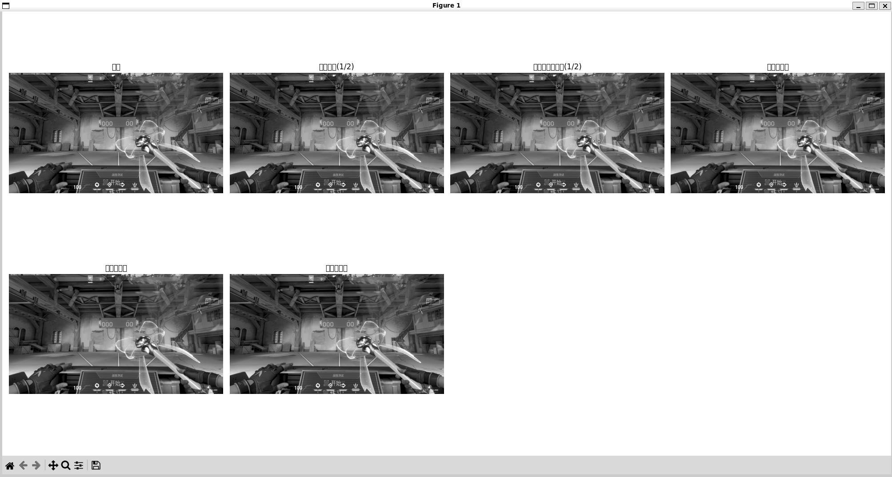
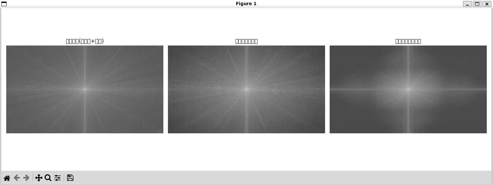
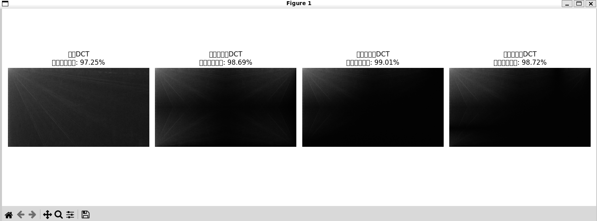

```markdown
# 图像缩小、恢复与频域分析实验

本实验基于 OpenCV 实现灰度图像的下采样、三种插值方法的图像恢复，并结合傅里叶变换（FFT）和离散余弦变换（DCT），对原图与恢复图进行空间域、频域的多维度分析。

---

## 实验环境
- Python 3
- OpenCV
- NumPy
- Matplotlib

### 依赖安装
```bash
pip install -r requirements.txt
```

---

## 运行方式
```bash
python image_process.py
```

---

## 一、实验内容
1.  读取灰度图像，完成预处理
2.  对图像进行 1/2 比例下采样（高斯平滑下采样，抗混叠）
3.  使用三种内插方法将缩小图像恢复至原始尺寸：
    - 最近邻内插
    - 双线性内插
    - 双三次内插
4.  计算 MSE、PSNR 进行空间域质量评价
5.  对原图、缩小图、双线性恢复图进行傅里叶频谱分析
6.  对原图与恢复图进行 DCT 变换，统计低频能量占比

---

## 二、实验参数
- 原始图像尺寸：**2560 × 1440**
- 下采样比例：0.5
- 下采样后尺寸：**1280 × 720**

---

## 三、实验结果

### 1. 空间域质量评价（高斯平滑下采样后恢复）
| 内插方法 | MSE（均方误差） | PSNR（峰值信噪比，dB） |
|----------|------------------|-------------------------|
| 最近邻内插 | 93.94 | 28.40 |
| 双线性内插 | 96.07 | 28.30 |
| 双三次内插 | 78.98 | 29.16 |

**分析**：
- 双三次内插 MSE 最低、PSNR 最高，恢复质量最优，细节保留最完整
- 最近邻内插边缘锯齿明显，双线性内插平滑效果好但细节损失较多
- 高斯平滑下采样有效抑制了混叠失真，提升了整体恢复质量

### 空间域对比图


---

### 2. 傅里叶变换（FFT）频谱分析
- **原图频谱**：高频分量丰富，对应图像边缘、纹理等细节信息
- **缩小图频谱**：高频分量大幅衰减，下采样过程中丢失了大量高频细节
- **双线性恢复图频谱**：高频分量远低于原图，内插仅能做平滑估计，无法恢复丢失的高频信息

### 频谱对比图


---

### 3. DCT 离散余弦变换分析
#### 低频能量占比（10% 区域）
| 图像 | 低频能量占比 |
|------|--------------|
| 原图 | 97.25% |
| 最近邻内插恢复图 | 98.69% |
| 双线性内插恢复图 | 99.01% |
| 双三次内插恢复图 | 98.72% |

**分析**：
- 所有图像能量高度集中在左上角低频区域，符合 DCT 的能量聚集特性
- 双线性内插平滑效果最强，低频能量占比最高，高频细节损失最多
- 双三次内插的能量分布最接近原图，恢复质量最优

### DCT 能量对比图


---

## 四、实验结论
1.  **下采样方式**：高斯平滑下采样能有效抑制混叠失真，恢复图质量显著优于直接下采样
2.  **内插方法对比**：双三次内插恢复质量最高，双线性居中，最近邻最差
3.  **频域特征**：下采样会不可逆丢失高频分量，内插仅能平滑估计，无法恢复丢失的高频信息
4.  **DCT 能量分布**：图像能量高度集中在低频区域，内插方法的平滑效果越强，低频能量占比越高

---

## 项目文件说明
```
├── README.md                  # 本实验报告
├── image_process.py            # 完整实验代码
├── test.png                    # 实验用测试图像
├── requirements.txt            # 依赖库清单
├── spatial_domain_comparison.png  # 空间域对比图
├── fft_spectrum_comparison.png     # 傅里叶频谱对比图
└── dct_energy_comparison.png       # DCT能量对比图
```
```

---

